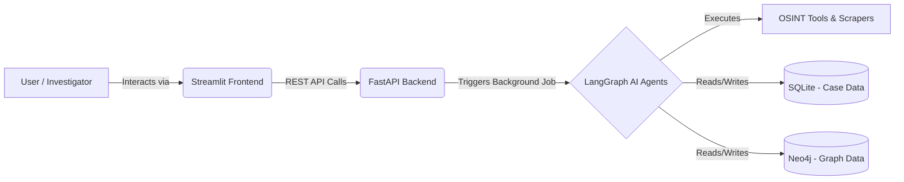

# OSINT-V1: Automated Threat Intelligence & Correlation Engine

## 1. Introduction

**OSINT-V1** is an advanced, AI-driven Open-Source Intelligence (OSINT) gathering and correlation platform. Designed to accelerate digital investigations, the system leverages autonomous AI agents to scrape, analyze, and map digital footprints associated with a target (such as an email, username, phone number, or domain). 

Unlike traditional OSINT tools that require manual execution and correlation, this project introduces a fully autonomous **Multi-Agent Workflow** using LLMs to reason about the target, select the appropriate tools, scrape the web, and construct a deterministic knowledge graph. The final output is a comprehensive, sleekly formatted dossier (PDF/HTML) outlining the target's digital presence, associations, and potential threats.

### Project Team
* **Abhinav Manoj**
* **Niranjan J**
* **Hajira Harris**
* **Gowri G R**

---

## 2. Technology Stack & Tools Used

The platform is built on a modern, asynchronous, and scalable architecture utilizing the following technologies:

### **Frontend Interface**
* **Streamlit**: Provides a rapid, interactive, and Python-native web interface for case management, triggering OSINT jobs, and visualizing reports.
* **Streamlit-Agraph**: Used for rendering interactive network graphs (nodes and edges) directly in the browser.

### **Backend & Core Services**
* **FastAPI**: A high-performance, asynchronous web framework serving the API endpoints.
* **Python 3.10+**: Core programming language.
* **Uvicorn**: ASGI web server implementation for FastAPI.

### **AI & Multi-Agent Framework**
* **LangChain & LangGraph**: The backbone of the agentic workflow. It orchestrates the ReAct (Reason + Act) loop, state management, and conditional routing between specialized agents.
* **Large Language Models (LLMs)**: Used for reasoning, tool selection, and narrative generation.
* **FAISS & Sentence-Transformers**: Utilized for semantic search and vector embeddings during data correlation.

### **Databases & Caching**
* **SQLite (via SQLAlchemy & aiosqlite)**: Handles relational data, including user accounts, case management metadata, and job history.
* **Neo4j**: A specialized graph database used to mathematically map and store deterministic connections between entities (e.g., `Username -> LINKED_TO -> Email`).
* **Redis**: In-memory data store acting as the message broker for background tasks.

### **Task Management & Scraping**
* **Celery**: Distributed task queue for running long-running OSINT investigations in the background without blocking the API.
* **SearxNG**: A privacy-respecting metasearch engine used by the web scraping agents.
* **BeautifulSoup4 & Patchright**: Used for parsing HTML and executing deep, dynamic web scraping.

### **OSINT Specific Tools & Integrations**
* **Sherlock & Holehe**: For username enumeration and email registration checks.
* **GitHub OSINT Tool**: Custom scraper to extract raw patch emails and connections.
* **Breach Data Search**: Queries exposed credential databases (e.g., HaveIBeenPwned).
* **Reverse Image Search & Extractors**: For facial OSINT and visual profiling.
* **DNS & Whois**: For domain intelligence.

### **Reporting**
* **Markdown-PDF**: Generates sleek, professional PDF dossiers.
* **Jinja2**: For dynamic HTML report templates.

---

## 3. System Architecture

### 3.1 Simple Architectural Diagram

This high-level diagram illustrates the basic flow of data from the user interface to the underlying databases.



### 3.2 Detailed Architectural Diagram

This diagram details the internal microservices, the specific agent nodes within the LangGraph workflow, and the Celery/Redis background task queue.

```mermaid
graph TD
    subgraph Client Layer
        UI[Streamlit UI]
    end

    subgraph API Layer
        API[FastAPI Server]
        Auth[JWT Authentication]
        Routers[Report & Case Routers]
    end

    subgraph Background Task Layer
        Broker[Redis Message Broker]
        CeleryWorker[Celery OSINT Worker]
    end

    subgraph LangGraph Multi-Agent Workflow
        Manager[Manager Agent]
        Discovery[Tool Discovery Agent]
        Scraper[Scraper Agent]
        Correlation[Correlation Agent]
        Reporting[Reporting Agent]
    end

    subgraph Data Layer
        RelDB[(SQLite: Cases/Jobs)]
        GraphDB[(Neo4j: Entities)]
    end

    subgraph External OSINT Tools
        Sherlock[Sherlock]
        Holehe[Holehe]
        GitHub[GitHub API]
        Breach[Breach Data]
        SearxNG[SearxNG Engine]
    end

    %% Connections
    UI -- "HTTP/REST" --> API
    API --> Auth
    API --> Routers
    Routers -- "Submit Job" --> Broker
    Broker -- "Consume" --> CeleryWorker
    
    CeleryWorker -- "Invoke Graph" --> Manager
    Manager -- "Query Type" --> Discovery
    Discovery -- "Select Tools" --> External OSINT Tools
    External OSINT Tools -- "Raw Data" --> Scraper
    Scraper -- "Extract Text" --> Correlation
    Correlation -- "Correlate & Map" --> GraphDB
    Correlation -- "Generate JSON" --> Reporting
    Reporting -- "Build PDF/HTML" --> RelDB
    
    %% Loop back
    Discovery -. "Return Control" .-> Manager
    Scraper -. "Return Control" .-> Manager
```

---

## 4. Approaches to the Solution

### 4.1 Non-Technical Approach (Conceptual Flow)

From a non-technical perspective, the system acts as a team of automated cyber investigators working together in a room:

1. **The Briefing (Input)**: The human investigator opens the dashboard, creates a "Case," and inputs a single piece of evidence (e.g., a username like `johndoe123`).
2. **The Dispatcher (Manager Agent)**: The "Lead Detective" receives the clue. Based on the fact that it's a username, it realizes it needs to search social media and code repositories.
3. **The Specialists (Tool Discovery & Execution)**: The Dispatcher assigns the task to specialists (Sherlock for social media, GitHub tool for code, Breach data for leaks).
4. **The Field Agents (Scraper)**: The field agents visit all the URLs found by the specialists, reading the pages to extract meaningful text, bios, and associated links.
5. **The Analyst (Correlation Agent)**: The Analyst takes hundreds of pages of raw notes from the field agents. It connects the dots: *"The GitHub bio mentions the email johndoe@example.com, and the breach database says that email lives in New York."*
6. **The Report Writer (Reporting Agent)**: The final synthesized story is handed to the writer, who produces a beautifully formatted, chronological PDF dossier containing a summary, a timeline, and a visual mind-map (graph) of the target.

### 4.2 Technical Approach (Implementation)

Technically, the solution leverages a **Stateful ReAct (Reasoning and Acting) Graph** via LangGraph:

1. **State Management**: A global `AgentState` dictionary is maintained throughout the workflow. It holds the `query`, `history`, `raw_data`, `urls_to_scrape`, and the `final_report`.
2. **Deterministic Routing**: 
   - The **Manager Node** acts as the entry point. It uses an LLM to read the `history` and decide if enough data has been gathered, or if it needs to route to `tool_discovery` or `scraper`.
   - The **Tool Discovery Node** uses a strict Prompt Template to map the `task_type` (e.g., `username_search`) to specific Python tool functions (`github_osint`, `sherlock`). It executes these tools synchronously and appends the raw text and URLs to the state.
3. **Semantic Correlation**: The **Correlation Node** uses a high-context LLM to parse the massive string of `raw_data`. It outputs a strictly formatted JSON array of `nodes` (entities) and `edges` (relationships).
4. **Graph Database Integration**: Using the Neo4j Python driver, the extracted JSON nodes are UPSERTED (merged) into the graph database. This guarantees that if multiple OSINT runs discover the same email, they link to the same core node mathematically, rather than relying on the LLM's memory.
5. **Asynchronous Execution**: Because OSINT tools (like web scraping and DNS lookups) are heavily I/O bound, the entire investigation logic is wrapped in a Celery Task. The FastAPI server immediately returns a `202 Accepted` status, allowing the Streamlit frontend to poll for completion without HTTP timeouts.

---

## 5. Project Timeline

| Phase | Milestone | Focus Areas |
| :--- | :--- | :--- |
| **Phase 1** | **Planning & Architecture** | Defining the agent workflows, selecting the tech stack (FastAPI, Streamlit, LangGraph), and designing the Neo4j schema. |
| **Phase 2** | **Core Backend & Agent Framework** | Setting up SQLite, Celery, and Redis. Building the core LangGraph state machine (Manager, Correlation, Reporting nodes). |
| **Phase 3** | **OSINT Tool Integration** | Developing and integrating custom Python modules for Sherlock, Holehe, Reverse Image Search, Breach Data, and GitHub Scraping. |
| **Phase 4** | **Frontend & Data Visualization** | Building the Streamlit UI, case management dashboards, and integrating `streamlit-agraph` for visual network analysis. |
| **Phase 5** | **Testing, Polish & Reporting** | Refining LLM prompts to reduce hallucinations, fixing PDF generation dependencies (`markdown-pdf`), and end-to-end bug fixing. |

---
*Documentation compiled by the AI Assistant on behalf of the OSINT-V1 Development Team.*
